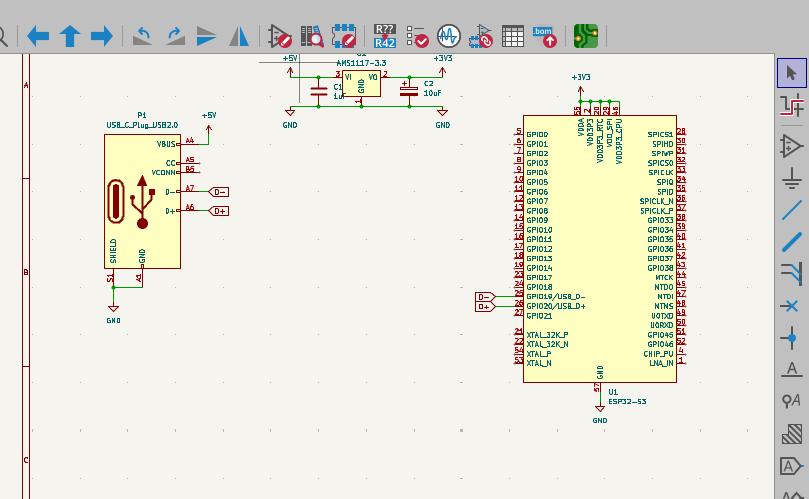

# 5/20: Created project and designed schematic
I Created project and Kicad files.
I’ve drawn up a schematic as well. At first, I was thinking of using WROOM, but since the versions with Technical Conformity Mark are expensive, I’ve decided to just use the chip on its own.

**Total time spent: 4 hours**