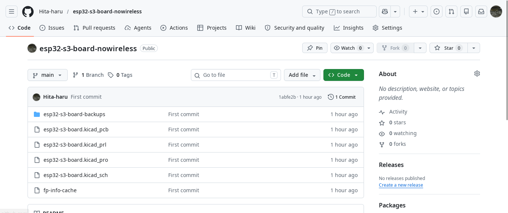
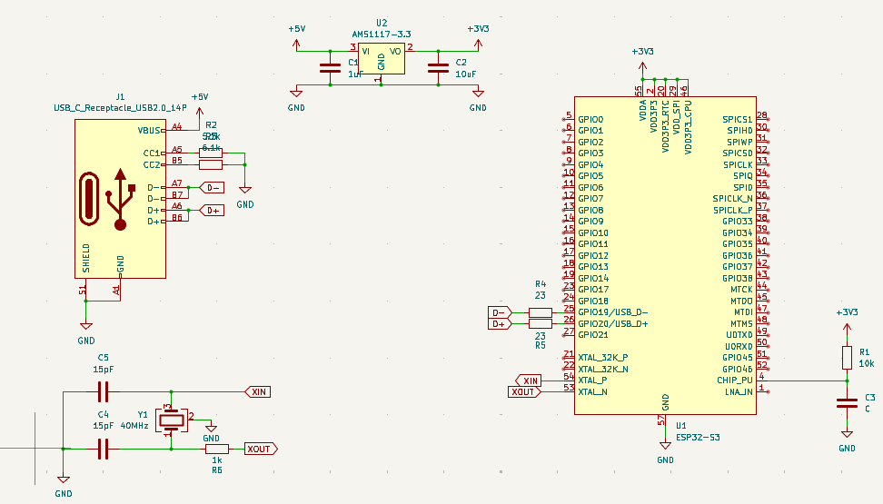
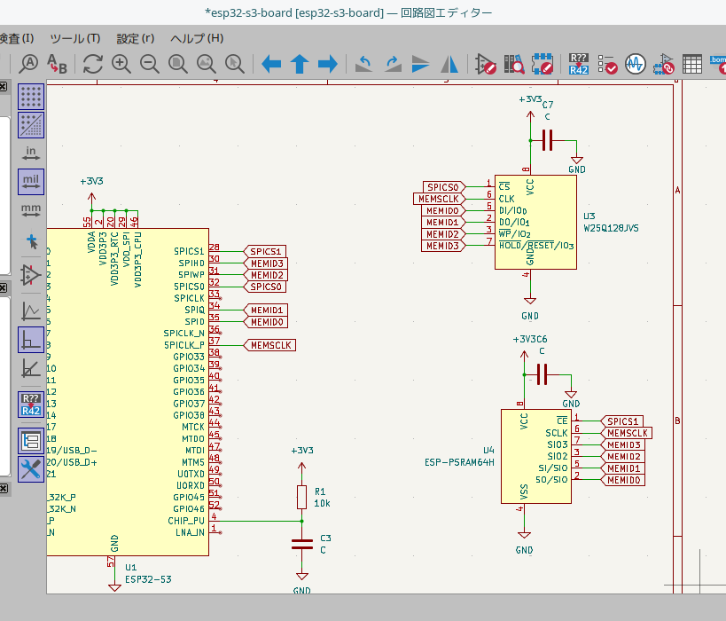
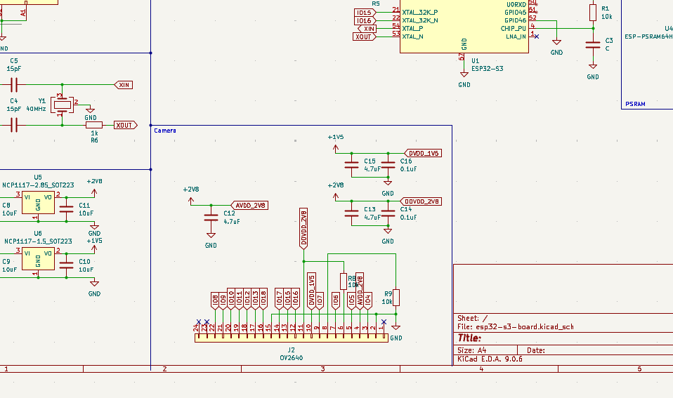
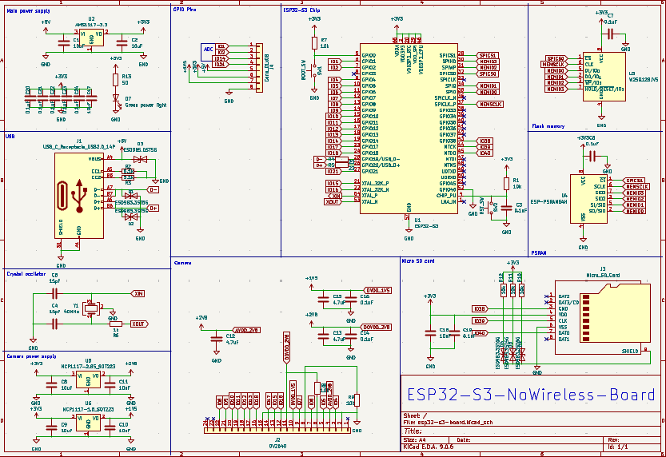

# 5/20: Created project and designed schematic
I Created project and Kicad files.
I’ve drawn up a schematic as well. At first, I was thinking of using WROOM, but since the versions with Technical Conformity Mark are expensive, I’ve decided to just use the chip on its own.

**Total time spent: 4 hours**

# 5/22: Set up git and added crystal oscillator and so on
I set up GitHub.
I also added a crystal oscillator and modified the USB connector.
Unfortunately, there wasn’t much documentation available, so I ended up spending quite a bit of time searching for information.

**Total time spent: 5 hours**

# 5/23: Added flash memory and PSRAM to the schematic
I added flash memory and PSRAM to the circuit diagram.
As usual, there was no detailed documentation, so I added them while referring to the Blueprint's guide.
Other than that, I just added a connector for attaching a camera.
It took me forever to find the documentation, so it was a real hassle.

**Total time spent: 4 hours**

# 5/26: Added camera and power supply to the schematic
Today, I added a camera to the circuit diagram, using the ESP32-S3-EYE circuit diagram as a reference. I think it will be quite difficult because there will likely be a lot of noise.

**Total time spent: 4 hours**

# 5/27: Finished writing schematic
I finished drawing the circuit diagram today. Lately, I’ve been working on it for about an hour in the morning and three hours at night, but I got so absorbed in it that I ended up working on it for six hours.
I have midterms coming up at school, but I haven’t studied at all—this is bad.

**Total time spent: 5 hours**