# 5/20: Created project and designed schematic
I Created project and Kicad files.  
I’ve drawn up a schematic as well. At first, I was thinking of using WROOM, but since the versions with Technical Conformity Mark are expensive, I’ve decided to just use the chip on its own.  

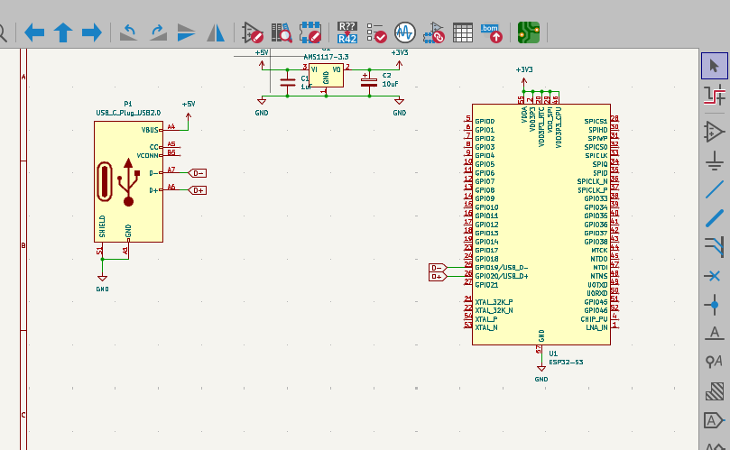  
**Total time spent: 2 hours**

# 5/22: Set up git and added crystal oscillator and so on
I set up GitHub.  
I also added a crystal oscillator and modified the USB connector.  
Unfortunately, there wasn’t much documentation available, so I ended up spending quite a bit of time searching for information.  

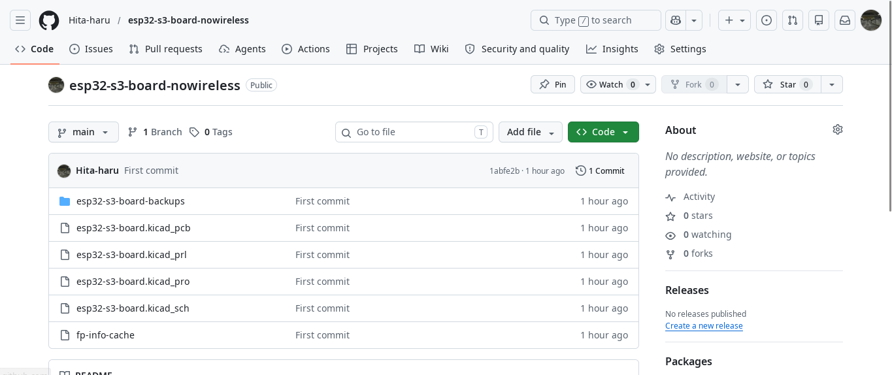
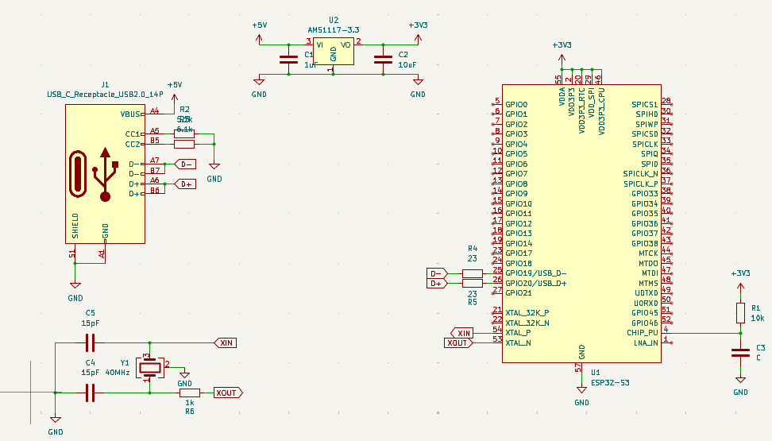  
**Total time spent: 2 hours**

# 5/23: Added flash memory and PSRAM to the schematic
I added flash memory and PSRAM to the circuit diagram.  
As usual, there was no detailed documentation, so I added them while referring to the Blueprint's guide.  
Other than that, I just added a connector for attaching a camera.  
It took me forever to find the documentation, so it was a real hassle.  

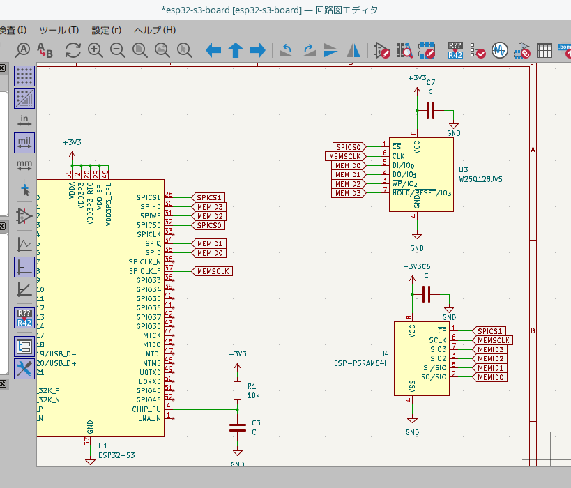  
**Total time spent: 2 hours**

# 5/26: Added camera and power supply to the schematic
Today, I added a camera to the circuit diagram, using the ESP32-S3-EYE circuit diagram as a reference.  
I think it will be quite difficult because there will likely be a lot of noise.  

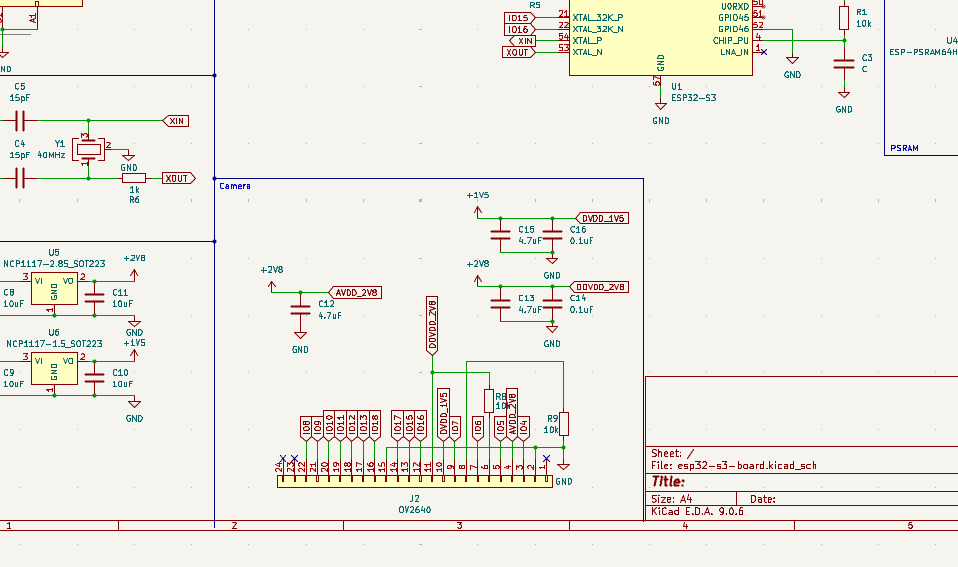  
**Total time spent: 2 hours**

# 5/27: Finished writing schematic
I finished drawing the circuit diagram today.  
Lately, I’ve been working on it for about an hour in the morning and three hours at night, but I got so absorbed in it that I ended up working on it for six hours.  
I have midterms coming up at school, but I haven’t studied at all—this is bad.  

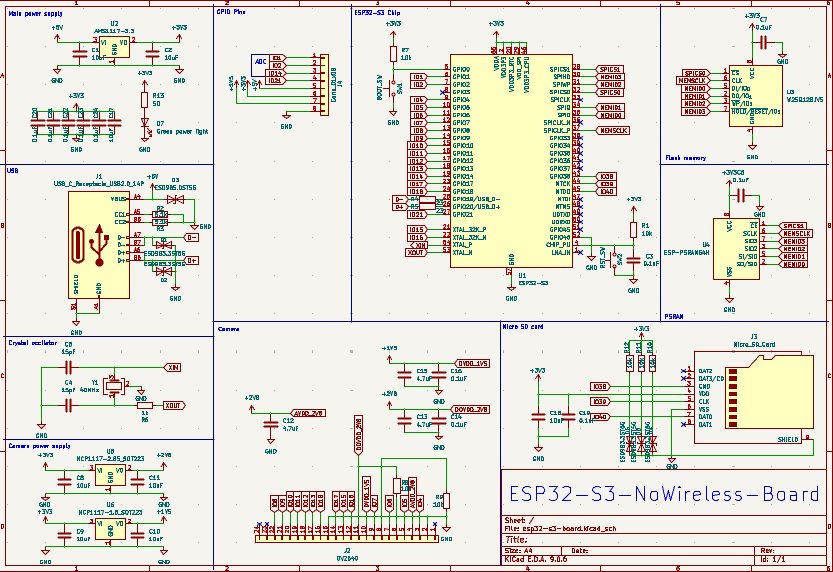  
**Total time spent: 2 hours**

# 5/28: Assigned the footprint.
I finished drawing the circuit diagram today.  
Lately, I’ve been working on it for about an hour in the morning and three hours at night, but I got so absorbed in it that I ended up working on it for six hours.  
I have midterms coming up at school, but I haven’t studied at all—this is bad.  

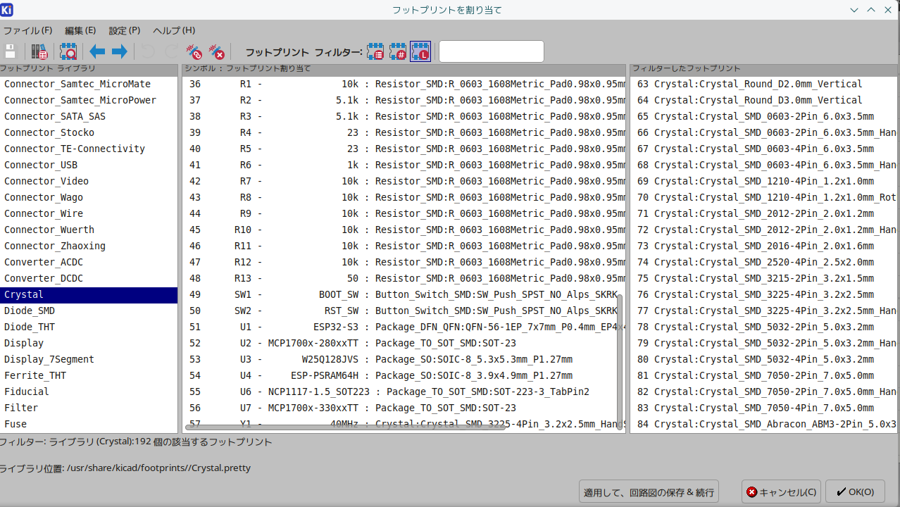  
**Total time spent: 0.5 hours**

# 5/29: Routed for the first time
This time, I worked on routing the PCB.  
It was a total mess, and it really made my head spin, but as I worked on it, it started to feel like I was solving a puzzle, and I got so absorbed in it that before I knew it, it was 11 p.m.  

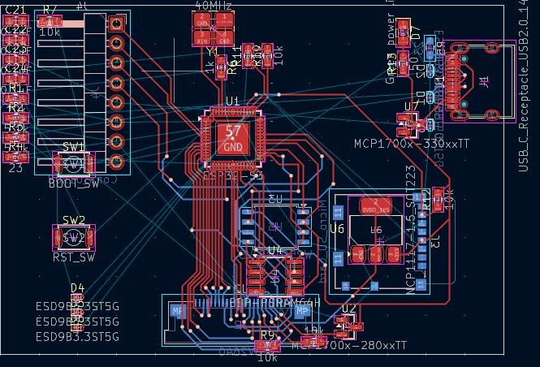  
**Total time spent: 3.5 hours**

# 5/30: Finished routing PCB around main chip
I couldn’t bring myself to study today, so I spent the whole day working on the PCB layout.  
I’ve finished routing the main chip, flash memory, and PSRAM.  
It was quite a challenge figuring out the noise countermeasures, so it was tough going.  
I’ll be happy if it works.  

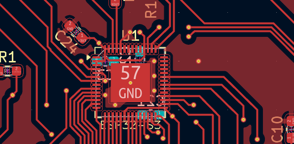  
**Total time spent: 3 hours**

# 5/30: Finished routing PCB
I've finished all the wiring.  
I installed the USB connector, TF card slot, and other components.  
I spent the whole day working on this, so I'm worried about my midterms.  

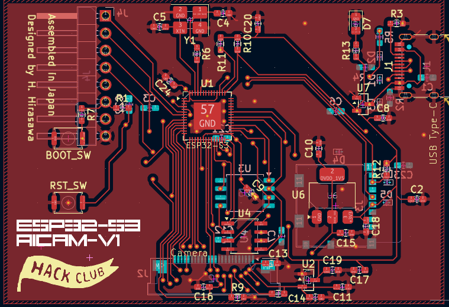  
**Total time spent: 2 hours**  

# 5/31: Created quotes from JLCPCB and LCSC
Today, I created a quote for JLCPCB. I’m also in the middle of creating a quote for LCSC.  
Since I’m entering everything manually based on the BOM, it’s quite time-consuming.  
Also, I’ll add a screenshot of the “Journal” feature—the previous one only showed the front side.  

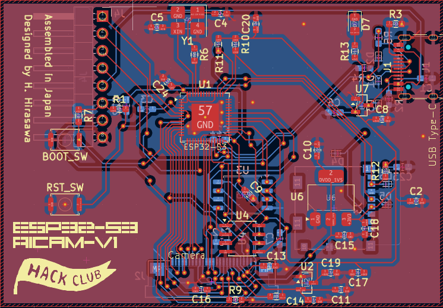

  
**Total time spent: 2 hours**

# 6/1: Created quotes from LCSC and Aliexpress
Today, I requested quotes from LCSC and AliExpress.  
Now that I’m ready to place the order, all I can do is hope it passes the review process.  

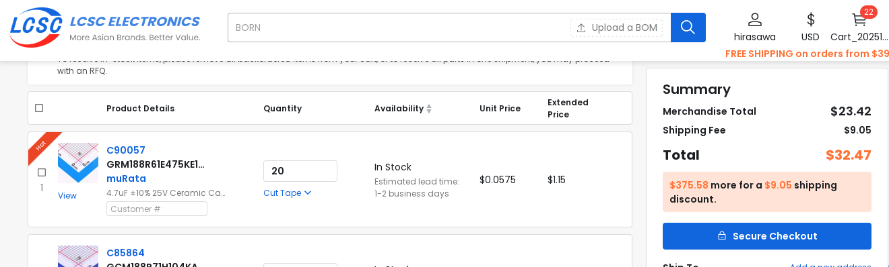  
  
  
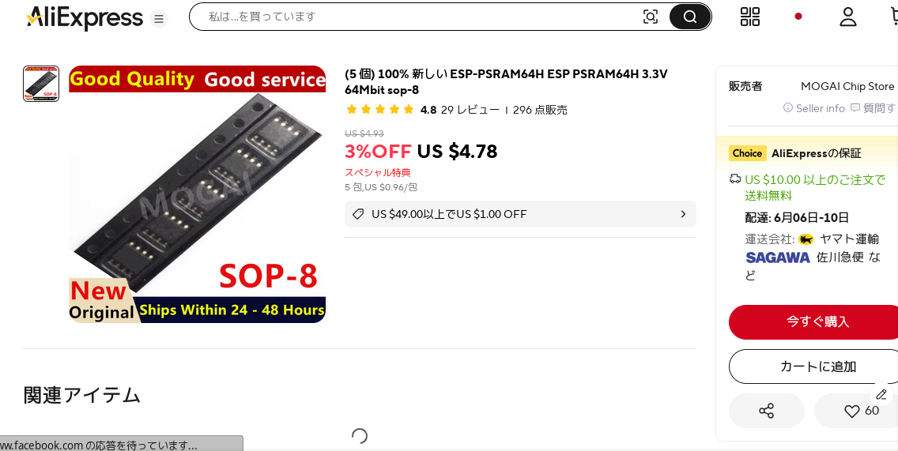  
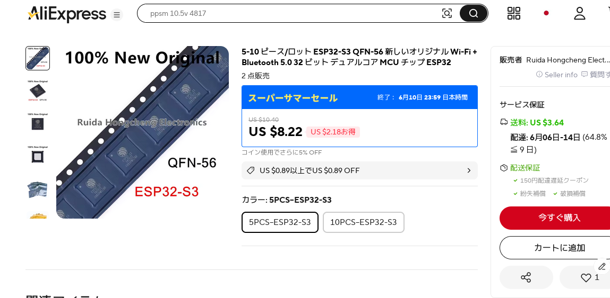  
**Total time spent: 1.5 hours**  

# 6/2: Fixed README.md and fabrication files
Today, I fixed the issues pointed out in the review.  
I regenerated the build files and added a link to the BOM in README.md, so I think it should work now.  

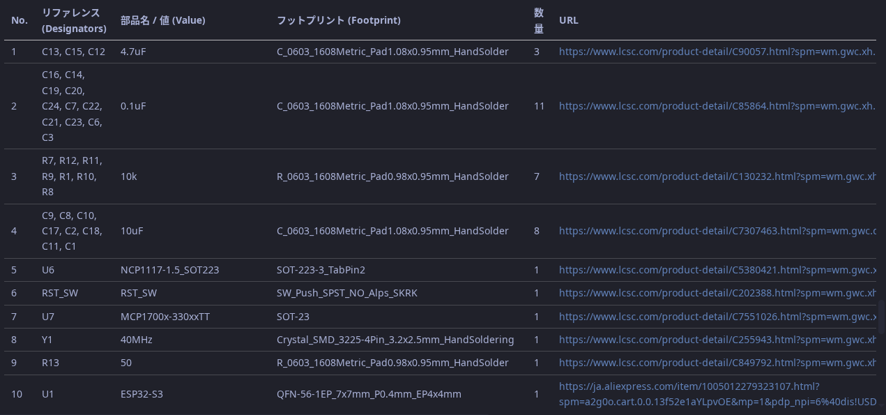  
**Total time spent: 1 hours**  

# 6/4: Updated the JOURNAL.md file and the PCB
Today, I made some changes to JOURNAL.md and the PCB.  
The PCB was primarily designed to ensure that the USB signal lines were of equal length.  
I don't think I've finished revising JOURNAL.md and the rest just yet, so I plan to continue working on them tomorrow.  

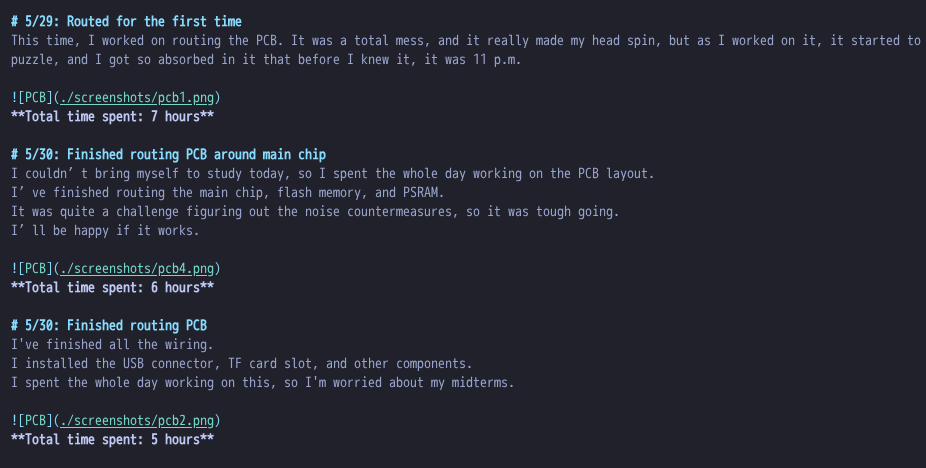  
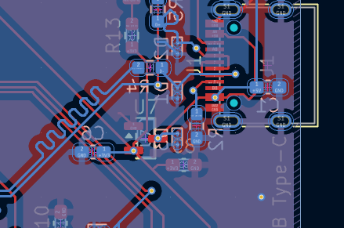  
**Total time spent: 1.5 hours**

# 6/6: Updated the README.md
I updated the README.md today.  
I went to school yesterday and was out all day, so I did it today.  
I made sure it meets all the requirements, so I hope the review goes through.  

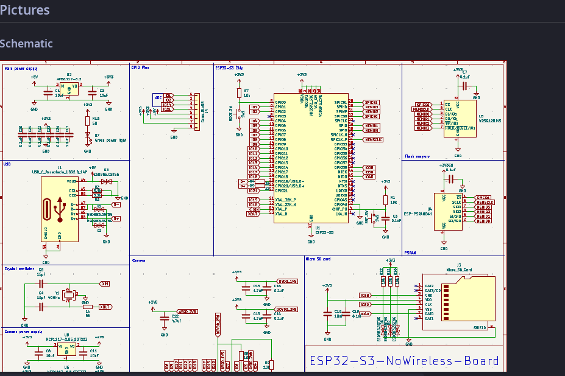
**Total time spent: 0.5 hours**

# 6/6: Updated the README.md and added gerber.zip
I've updated README.md again.  
I've added information about costs to the BOM and the newly created section.  
Also, I forgot to create the gerber.zip file, so I've created it now.  

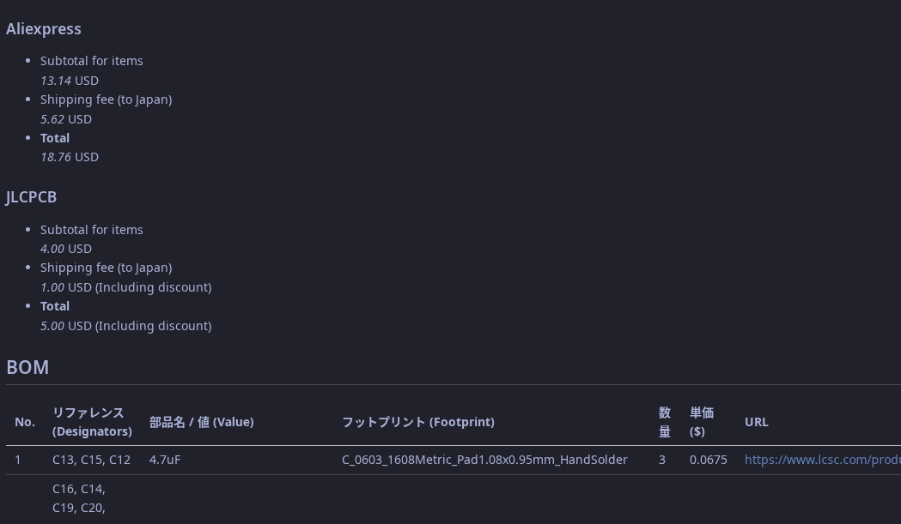
**Total time spent: 1 hours**

# 6/19: Updated the JOURNAL.md
I took another look at this, and since I’d recorded the times vaguely, it’s clear that I’ve logged way too much time. It’s my fault for just recording them casually, thinking, “This should be about right.” I’m really sorry...
I’ve roughly halved all the recorded times, so I’d be happy if this gets approved.
I’ll use a stopwatch from now on.

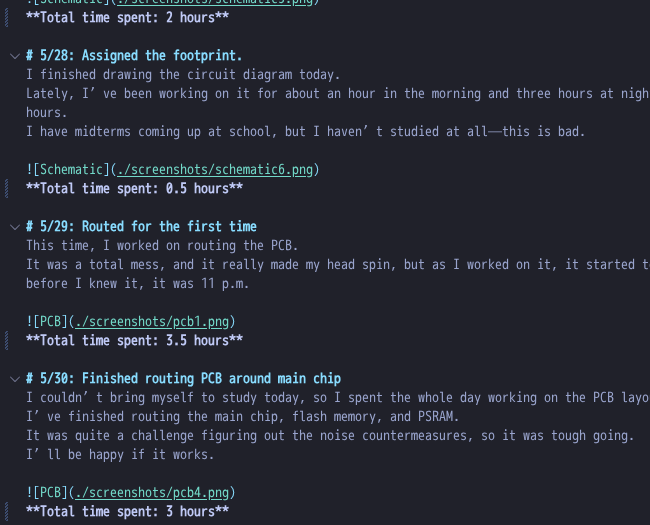
**Total time spent: 0.5 hours**